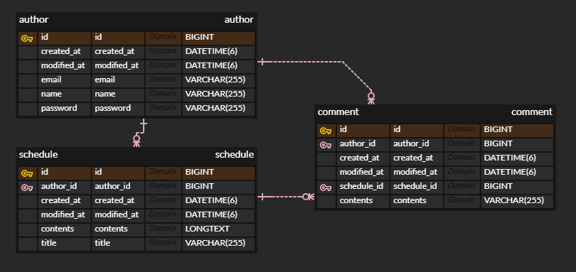

# 📝 스케줄러 만들기(Jpa 적용)

🐥 개발 기간 : 2025.05.19 ~ 2025.05.26

 
 

## ⚙️ 시작 가이드
### ERD

## API 문서
🔗 API 문서(https://documenter.getpostman.com/view/44665083/2sB2qcCLZa)

 
 

## 📌 Lv 1 : 일정 CRUD 

* **일정 생성, 조회, 수정, 삭제**: 일정을 관리할 수 있는 기본적인 CRUD 기능을 제공합니다.
* **일정 필드**:
    * 작성 유저명
    * 할일 제목
    * 할일 내용
    * 작성일 (JPA Auditing 활용)
    * 수정일 (JPA Auditing 활용)
 

## 📌 Lv 2. 유저 CRUD

* **유저 생성, 조회, 수정, 삭제**: 사용자 정보를 관리하는 CRUD 기능을 제공합니다.
* **유저 필드**:
    * 유저명
    * 이메일
    * 작성일 (JPA Auditing 활용)
    * 수정일 (JPA Auditing 활용)
* **연관관계 구현**: 일정은 이제 작성 유저명 대신 유저 고유 식별자 필드를 가집니다.

## 📌 Lv 3. 회원가입
  
* **비밀번호 필드 추가**: 유저 엔티티에 비밀번호 필드가 추가

## 📌 Lv 4. 로그인(인증)

* **Cookie/Session 활용**
* **필터 기반 인증 처리**: `Filter`를 활용하여 인증 처리를 수행합니다.
* **로그인 조건**: 이메일과 비밀번호를 사용하여 로그인합니다.
* **인증 제외**: 회원가입 및 로그인 요청은 인증 처리에서 제외됩니다.
* **예외 처리**: 로그인 시 이메일과 비밀번호가 일치하지 않을 경우 **HTTP Status code 401**을 반환

## 📌 Lv 5. 다양한 예외처리 적용

* **Validation**: Bean Validation을 활용하여 다양한 예외 처리를 적용합니다.
    * **예시**: 할일 제목은 10글자 이내, 유저명은 4글자 이내
    * `@Pattern`을 사용하여 회원가입 시 이메일 데이터 검증 (정규표현식 활용)

## 📌 Lv 6. 비밀번호 암호화

* **비밀번호 암호화**: Lv.3에서 추가된 비밀번호 필드의 비밀번호를 암호화

## 📌 Lv 7. 댓글 CRUD

* **일정-댓글 연관관계**: 생성된 일정에 댓글을 남길 수 있으며, 댓글과 일정은 연관관계를 가집니다.
* **댓글 저장, 조회, 수정, 삭제**: 댓글에 대한 CRUD 기능을 제공합니다.
* **댓글 필드**:
    * 댓글 내용
    * 작성일 (JPA Auditing 활용)
    * 수정일 (JPA Auditing 활용)
    * 유저 고유 식별자
    * 일정 고유 식별자

 
## 📌 Lv 8. 일정 페이징 조회

* **Spring Data JPA 페이징**: `Pageable`과 `Page` 인터페이스를 활용하여 일정 목록에 대한 페이지네이션을 구현합니다.
* **쿼리 파라미터**: 페이지 번호와 페이지 크기를 쿼리 파라미터로 전달하여 요청하는 항목을 나타냅니다.
* **조회 필드**: 할일 제목, 할일 내용, 댓글 개수, 일정 작성일, 일정 수정일, 일정 작성 유저명 필드를 조회합니다.
* **기본 페이지 크기**: 디폴트 페이지 크기는 10으로 설정됩니다.
* **정렬**: 일정의 수정일을 기준으로 내림차순 정렬하여 조회합니다.

 
 

## 🤔 스케줄러 개발 회고

### Repository에서의 Join 고민과 해결

-   이번 프로젝트를 진행하며 Repository 계층에서 엔티티 간의 Join을 지양해야 한다는 저의 개발 신념과 마주한 순간이 있었습니다. 이상적으로는 각 엔티티의 Repository는 자신의 도메인에만 집중하고, 여러 엔티티의 데이터를 결합해야 할 때는 Service 계층에서 각각의 Repository를 호출하여 조합하는 방식을 선호합니다. 이는 **단일 책임 원칙(Single Responsibility Principle)**을 지키고, Repository의 재사용성을 높이며, 도메인 로직을 더 명확하게 분리하는 데 도움이 된다고 생각하기 때문입니다.

    하지만 ScheduleGetAllResponseDto를 구현하는 과정에서 큰 고민에 빠졌습니다. 목표는 스케줄 정보와 함께 해당 스케줄에 달린 댓글의 개수, 그리고 작성자 이름까지 한 번의 조회로 가져오는 것이었습니다. Service 계층에서 ScheduleRepository와 CommentRepository, AuthorRepository를 각각 호출하여 데이터를 조합하는 방식을 시도했지만 복잡한 로직으로 인해 성능 저하가 우려되었습니다. 특히 페이징 처리까지 고려해야 했기에, 이 방식으로는 효율적인 구현이 어렵다고 판단했습니다.

    결과적으로, 저는 @Query 어노테이션을 사용하여 Repository 계층에서 직접 JPQL Join 쿼리를 작성하는 방법을 선택했습니다.
    이 결정은 저의 초기 신념과는 달랐지만 다음과 같은 장점을 얻을 수 있었습니다.
    *   성능 최적화: 단 한 번의 데이터베이스 쿼리로 필요한 모든 정보를 가져올 수 있어 쿼리 횟수를 최소화했습니다.
    *   간결한 Service 로직: Service 계층에서는 Repository 메서드를 호출하는 것 외에 복잡한 데이터 조합 로직이 필요 없어졌습니다.
 
    물론 Repository가 특정 비즈니스 요구사항에 강하게 결합되는 단점이 있지만, 현재 요구사항을 가장 효율적으로 충족시키면서도 시스템의 복잡성을 관리 가능한 수준으로 유지할 수 있는 현실적인 타협점이라고 판단했습니다.

    이번 경험을 통해, 원칙을 고수하는 것도 중요하지만 실제 문제 해결을 위해 유연하게 사고하고 최적의 방법을 찾아내는 것이 개발자의 중요한 역량임을 다시 한번 깨달았습니다.
    
